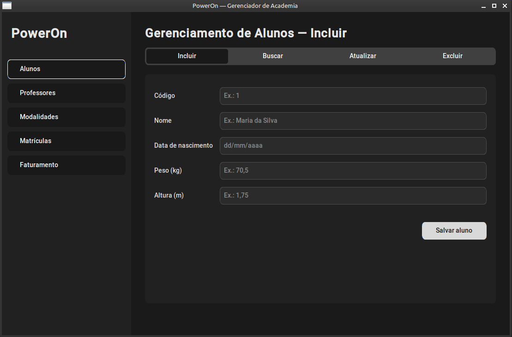

# PowerOn — Sistema de Gestão para Academia

Sistema completo de gestão para a academia fictícia **PowerOn**, desenvolvido em **Python** como trabalho prático acadêmico. O projeto implementa o conceito de **arquivos indexados**, utilizando uma **Árvore Binária de Busca em memória** para a indexação rápida dos registros persistidos em disco.

---

## 📸 Interface do Sistema



---

## 🛠️ Tecnologias Utilizadas

* **Python 3.10+** (desenvolvido e testado em Python 3.12)
* **[CustomTkinter](https://customtkinter.tomschimansky.com/)**: Biblioteca para criação de interfaces gráficas modernas, intuitivas e com suporte a temas visuais escuros/claros.
* **DarkDetect**: Detecção do tema do sistema operacional.
* **JSON**: Serialização estruturada dos registros de dados.
* **Estrutura de Dados Nativa**: Árvore Binária e nós de índice implementados sem dependência de bibliotecas externas de banco de dados.

---

## 🎯 Objetivo e Arquitetura

O sistema atende à necessidade da academia de gerenciar alunos, professores, modalidades esportivas e matrículas, oferecendo controle operacional e acompanhamento de faturamento com alta performance e integridade de dados.

### 1. Área de Índices (Árvore Binária em Memória)
* Cada tabela do sistema possui uma instância de **Árvore Binária de Busca** mantida em memória RAM.
* Cada nó da árvore armazena o `codigo` (chave primária) e a `posicao` física (offset em bytes) do registro correspondente no arquivo em disco.
* As operações de busca, inclusão e remoção operam em tempo logarítmico médio $O(\log n)$.
* Na inicialização da aplicação, o índice é **automaticamente reconstruído** a partir da leitura dos registros ativos em disco.

### 2. Área de Dados (Arquivos Indexados em Disco)
* Cada entidade é armazenada em um arquivo texto individual na pasta `data/`:
  * `data/alunos.txt`
  * `data/professores.txt`
  * `data/modalidades.txt`
  * `data/matriculas.txt`
* Os registros utilizam o modelo de **exclusão lógica**:
  * Registros ativos iniciam com a flag `1|`.
  * Registros excluídos ou atualizados são marcados com `0|` via escrita pontual (`seek()` e `write()`), preservando o histórico físico sem corromper o arquivo.
* O acesso aos dados é direto por deslocamento (`seek(no.posicao)`), evitando a leitura sequencial desnecessária do arquivo.

---

## ✨ Funcionalidades e Regras de Negócio

### 🏋️‍♂️ 1. Alunos
* **Campos**: Código, Nome, Data de Nascimento, Peso (kg) e Altura (m).
* **Validações**: Idade mínima de 14 anos, data de nascimento a partir de 1900, peso e altura estritamente positivos.
* **Cálculo de IMC**: Ao cadastrar, alterar ou consultar um aluno, o sistema calcula e exibe em tempo real o **Índice de Massa Corporal (IMC)** e o respectivo **diagnóstico** de acordo com a OMS:
  * Abaixo do peso ($< 18,5$)
  * Peso normal ($18,5$ a $24,9$)
  * Sobrepeso ($25,0$ a $29,9$)
  * Obesidade grau I ($30,0$ a $34,9$)
  * Obesidade grau II ($35,0$ a $39,9$)
  * Obesidade grau III ($\ge 40,0$)

### 👨‍🏫 2. Professores
* **Campos**: Código, Nome, Endereço e Telefone.
* **Validações**: Telefone celular formatado e validado estritamente com 11 dígitos numéricos (DDD + número).

### 🥋 3. Modalidades
* **Campos**: Código, Descrição, Código do Professor, Valor da Aula, Limite de Alunos e Total de Alunos matriculados.
* **Integração**: Ao informar ou visualizar o código do professor, o sistema exibe dinamicamente o **nome do professor associado**.
* **Validação**: Uma modalidade só pode ser cadastrada se o professor correspondente existir no sistema.

### 📝 4. Matrículas
* **Campos**: Código da Matrícula, Código do Aluno, Código da Modalidade e Quantidade de Aulas contratadas.
* **Feedback Dinâmico**: Ao digitar o código do aluno e o código da modalidade, o sistema busca e exibe imediatamente o **nome do aluno** e a **descrição da modalidade**.
* **Controle de Vagas**:
  * Antes de incluir uma matrícula, o sistema valida se há vagas disponíveis ($\text{Total de Alunos} < \text{Limite de Alunos}$).
  * Após a inclusão, o campo `Total_Alunos` da modalidade é **incrementado em 1**.
  * Ao excluir uma matrícula, o campo `Total_Alunos` da modalidade é **decrementado em 1**.

### 💰 5. Faturamento por Modalidade
* Ao informar o código de uma modalidade, o sistema calcula e apresenta:
  * A descrição da modalidade;
  * O nome do professor responsável;
  * O **faturamento total**, obtido pelo somatório das aulas contratadas por todos os alunos matriculados multiplicado pelo valor unitário da aula:
  $$\text{Faturamento} = \text{Valor da Aula} \times \sum (\text{Qtde de Aulas de cada Matrícula da Modalidade})$$

### 🔒 6. Integridade Referencial
O sistema impede exclusões acidentais em cascata:
* Professores com modalidades vinculadas não podem ser excluídos.
* Modalidades com matrículas vinculadas não podem ser excluídas.
* Alunos com matrículas ativas não podem ser excluídos.

---

## 📂 Estrutura do Repositório

```text
gerenciador-academia-python/
│
├── assets/                  # Recursos visuais (prints e imagens)
│   └── tela_inicial.png
│
├── data/                    # Arquivos de dados persistidos em disco
│   ├── .gitkeep
│   ├── alunos.txt
│   ├── matriculas.txt
│   ├── modalidades.txt
│   └── professores.txt
│
├── models/                  # Entidades de domínio e regras de atributos
│   ├── aluno.py
│   ├── professor.py
│   ├── modalidade.py
│   └── matricula.py
│
├── repositories/            # Camada de persistência em arquivos indexados
│   ├── repositorio.py
│   └── tipo_repositorio.py
│
├── services/                # Regras de negócio e integridade entre entidades
│   ├── aluno_service.py
│   ├── professor_service.py
│   ├── modalidade_service.py
│   ├── matricula_service.py
│   └── faturamento_service.py
│
├── structures/              # Estruturas de dados em memória
│   ├── no.py
│   └── arvore_binaria.py
│
├── utils/                   # Validadores, conversores e formatadores
│   ├── validador.py
│   ├── conversor.py
│   └── formatador.py
│
├── views/                   # Interface gráfica (CustomTkinter)
│   ├── principal_view.py
│   ├── aluno_view.py
│   ├── professor_view.py
│   ├── modalidade_view.py
│   ├── matricula_view.py
│   └── faturamento_view.py
│
├── tema.json                # Configurações de cores e tema visual
├── requirements.txt         # Dependências do projeto
├── main.py                  # Ponto de entrada da aplicação
└── README.md                # Documentação do projeto
```

---

## 🚀 Como Executar o Projeto

### Pré-requisitos
* **Python 3.10** ou superior instalado no sistema.
* Gerenciador de pacotes **pip**.

### Passo a Passo

1. **Clone ou extraia o repositório:**
   ```bash
   git clone https://github.com/DarioKlein/gerenciador-academia-python.git
   cd gerenciador-academia-python
   ```

2. **Crie e ative um ambiente virtual (recomendado):**
   * No Linux / macOS:
     ```bash
     python3 -m venv .venv
     source .venv/bin/activate
     ```
   * No Windows:
     ```bash
     python -m venv .venv
     .venv\Scripts\activate
     ```

3. **Instale as dependências:**
   ```bash
   pip install -r requirements.txt
   ```

4. **Inicie o sistema:**
   ```bash
   python main.py
   ```
